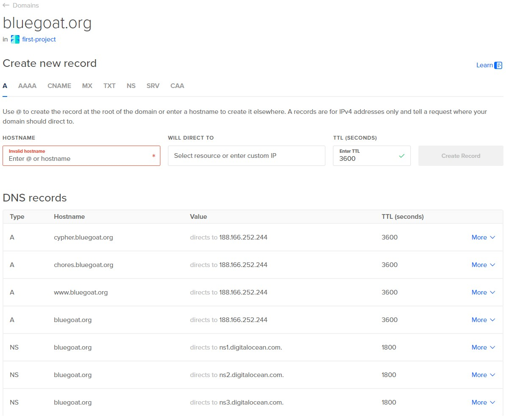
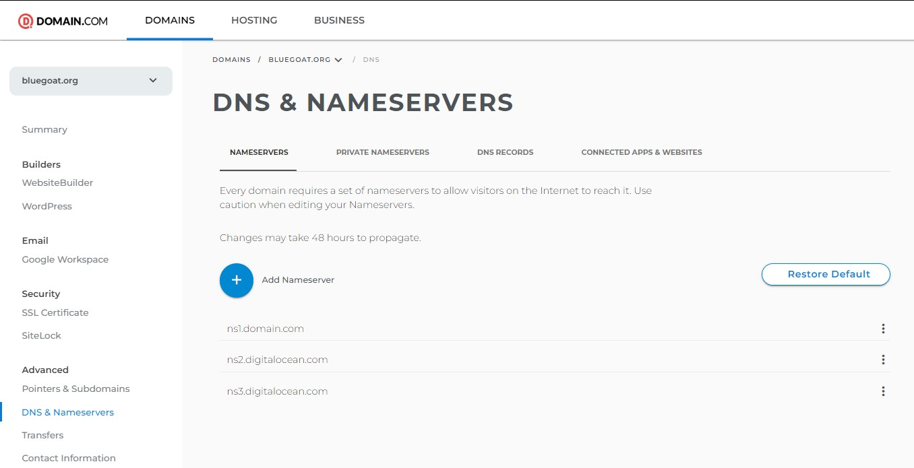

# Install the nginx-ingress controller
kubectl apply -f https://raw.githubusercontent.com/kubernetes/ingress-nginx/controller-v1.10.1/deploy/static/provider/cloud/deploy.yaml
# Create CA key
```
openssl genrsa -out ca.key 2048
```
# Get IP of Loadbalancer
kubectl get services ingress-nginx-controller -n ingress-nginx -o jsonpath="{.status.loadBalancer.ingress[0].ip}"
# Add Loadbalancer DNS entry to pi-hole
# Generate CA cert (used IP in testing but maybe can use DNS from pihole)
```
openssl req -x509 -new -nodes -key ca.key -sha256 -subj "/CN=x.x.x.x.nip.io" -days 1024 -out ca.crt -extensions san -config <(
echo '[req]';
echo 'distinguished_name=req';
echo '[san]';
echo 'subjectAltName=DNS:x.x.x.x.nip.io')
```
# Create TLS Secret
```
kubectl create secret tls ingress-local-tls \
  --cert=ca.crt \
  --key=ca.key -n default
```
# Add to Ingress
```
tls:
    - hosts:
        - "x.x.x.x.nip.io"
      secretName: ingress-local-tls
```
# This was the Ingress for the drawio
```
kind: Ingress
apiVersion: networking.k8s.io/v1
metadata:
  name: drawio-ingress
  namespace: default
  uid: 6a2e31e9-2634-4498-8fcc-02d9cd007f40
  resourceVersion: '16100666'
  generation: 1
  creationTimestamp: '2024-05-07T02:23:03Z'
  labels:
    name: drawio-ingress
  managedFields:
    - manager: dashboard
      operation: Update
      apiVersion: networking.k8s.io/v1
      time: '2024-05-07T02:23:03Z'
      fieldsType: FieldsV1
      fieldsV1:
        f:metadata:
          f:labels:
            .: {}
            f:name: {}
        f:spec:
          f:ingressClassName: {}
          f:rules: {}
          f:tls: {}
    - manager: nginx-ingress-controller
      operation: Update
      apiVersion: networking.k8s.io/v1
      time: '2024-05-07T02:48:11Z'
      fieldsType: FieldsV1
      fieldsV1:
        f:status:
          f:loadBalancer:
            f:ingress: {}
      subresource: status
spec:
  ingressClassName: nginx
  tls:
    - hosts:
        - 192.168.1.203.nip.io
      secretName: ingress-local-tls
  rules:
    - host: 192.168.1.203.nip.io
      http:
        paths:
          - path: /
            pathType: Prefix
            backend:
              service:
                name: drawio-service
                port:
                  number: 80
status:
  loadBalancer:
    ingress:
      - ip: 192.168.1.203
```
# Browse to https://192.168.1.203.nip.io/ and download the cert from the address bar error
# Use MMC - certificates to import it to root
# Import it to root in Chrome as well

# the draw service incase needed
```
kind: Service
apiVersion: v1
metadata:
  name: drawio-service
  namespace: default
  uid: 7e7a6738-1814-4c1d-bd73-6a19620cdc5e
  resourceVersion: '15998291'
  creationTimestamp: '2024-05-06T12:07:01Z'
  annotations:
    metallb.universe.tf/ip-allocated-from-pool: first-pool
  managedFields:
    - manager: dashboard
      operation: Update
      apiVersion: v1
      time: '2024-05-06T12:07:01Z'
      fieldsType: FieldsV1
      fieldsV1:
        f:spec:
          f:allocateLoadBalancerNodePorts: {}
          f:externalTrafficPolicy: {}
          f:internalTrafficPolicy: {}
          f:ports:
            .: {}
            k:{"port":80,"protocol":"TCP"}:
              .: {}
              f:port: {}
              f:protocol: {}
              f:targetPort: {}
          f:selector: {}
          f:sessionAffinity: {}
          f:type: {}
    - manager: controller
      operation: Update
      apiVersion: v1
      time: '2024-05-06T12:07:02Z'
      fieldsType: FieldsV1
      fieldsV1:
        f:metadata:
          f:annotations:
            .: {}
            f:metallb.universe.tf/ip-allocated-from-pool: {}
        f:status:
          f:loadBalancer:
            f:ingress: {}
      subresource: status
spec:
  ports:
    - protocol: TCP
      port: 80
      targetPort: 8080
      nodePort: 31775
  selector:
    app: drawio
  clusterIP: 10.152.183.198
  clusterIPs:
    - 10.152.183.198
  type: LoadBalancer
  sessionAffinity: None
  externalTrafficPolicy: Cluster
  ipFamilies:
    - IPv4
  ipFamilyPolicy: SingleStack
  allocateLoadBalancerNodePorts: true
  internalTrafficPolicy: Cluster
status:
  loadBalancer:
    ingress:
      - ip: 192.168.1.202
```


# homelab
This project deploys a MicroK8s cluster along with some containers to a Physical Host.

## Physical Host
* Beelink SEi12 Mini PC
  * Intel i5-1235U (10 Cores 12 Threads)
  * 16GB Ram
  * 500GB NVMe SSD
  * 2TB SATA SSD

> __Note__: The Physical Host has the following partition scheme:
>
>     SWAP   16G
>     EXT4   50G   /
>     EXT4   398G  /var
>     FAT32  1G    /boot/efi

> __Note__: The 2TB SATA SSD should be formatted as NTFS and contain the following folder structure:
>
>
>     ├── Movies
>     ├── TV
>     ├── backup
>         ├── wikijs

## Installation Steps
### Provision the Physical Host
* Install Ubuntu server to your Physical Host using a USB or PXE-Boot installation https://github.com/deemack/pxe
* Give the Physical Host an IP address of 192.168.1.100.
* Run the following command to clone the repo and begin the setup script:
```
git clone https://github.com/deemack/homelab.git && cd homelab && sudo chmod +x setup_environment.sh && bash setup_environment.sh
```
* Once complete, run the following:
```
su vagrant
ssh ansible
cd ansible
ansible-playbook -i inventory playbooks/site.yml -K
```

* Once complete, a MicroK8s cluster will be running on the Physical Host with the following container/services
  * miniDLNA
  * Samba Share
  * wikijs
  * Kubernetes Dashboard

### Access the Kubernetes Dashboard from an external PC
* Run the following command on the Physical Host
```
token=$(microk8s kubectl -n kube-system get secret | grep default-token | cut -d " " -f1)
microk8s kubectl -n kube-system describe secret $token
```
* Navigate to \<Physical Host IP>:32075
* Use the token to log in
* You can also save this **cat /var/snap/microk8s/current/credentials/client.config** contents to file on your computer and use it to login as a **kubeconfig**

## Containers and Services
### Home Page
A static homepage that has links to some of the container webpages.
* The IP for the homepage is 192.168.1.240
* This IP is defined in the homelab/ansible/playbooks/roles/microk8s_cluster/files/ipaddresspool_metallb.yml configuration file.
* The html code for the webpage is in a configmap homelab/ansible/playbooks/roles/microk8s_homepage/files/configmap_homepage.yml
* Alternatively we could create our own image from a Dockerfile that injects the html file into the image upon creation.

----
### Minidlna
A Mini dlna server will be installed as a container in the MicroK8s cluster. It can be used to store TV Shows and Movies that are stored on the 2TB SSD mounted at **/mnt/storage/Movies** and **/mnt/storage/TV**
#### Restarting the minidlna service in the container to update the database.
This is useful if you have saved some new media straight onto the 2TB SSD and want the MiniDLNA server to update its content.
* Run the following commands to kill the pod, and kubernetes will re-create it.
```
microk8s kubectl get pods -n dlna-ns
microk8s kubectl exec -it -n dlna-ns dlna-b8775f74b-6lrsb -- /bin/bash -c "kill 1"
```
----
### SAMBA file share
The contents of **/mnt/storage** are shared over the network. The share can be accessed in File Explorer via **\\192.168.1.100\share**
Media can be copied into the **TV** and **Movies** folders for playback by the miniDLNA container.
The backups for **wikijs** are also available on the share.

----
### utorrent
- Access the utorrent web interface via **192.168.1.100:30333/gui**
- When adding a torrent, choose the sub-path directory as **/shared**.
- The completed downloads will be available in the **utorrent/done** folder over the network share.

----
### Wikijs
- Access WikiJs via **192.168.1.100:30331**
- Upon installation, the wikijs databse will be restored provided a backup exists in 2TB SSD at /mnt/storage/backup/wikijs/
- A cronjob runs each night to backup the database and copies the backup to /mnt/storage/backup/wikijs/
#### Manually Backing up the Postgres database
- Log into the Kubernetes Dashboard
- Click Pods then click the 3 dots on the wikijs postgres pod and click Execute
- In the terminal run the following command
```
pg_dump wikijs -U wikijs -F t > /var/lib/postgresql/data/wikibackup.tar
```
- This will create a backup of the database and it can be retrieved from the wikijs share on the 2TB SSD.
#### Manually Restoring the WikiJS Database after a fresh installation
- Copy the wikibackup.dump file to the /mnt/storage/wikijs/postgres/ directory on the Physical Host
- Log into the Kubernetes Dashboard
- Click Pods then click the 3 dots on the wikijs postgres pod and click Execute
- In the terminal run the following command
```
dropdb -U wikijs wikijs -f
createdb -U wikijs wikijs
pg_restore -U wikijs -d wikijs /var/lib/postgresql/data/<desired wikibackup file.tar>
```
- Next goto Deployments, and restart the **wikijs** deployment

----
### BlueGoat Web Server
- You will need to add DNS entries for your sub-domains in Digital Ocean.
- 

- You will also need to point your Domain hosting service DNS to Digital Ocean's DNS servers.
- 

----
### Chores Java Web App
- Shell script to run the jar (stored at /mnt/storage/chores.jar in this case)
```
#!/bin/bash
java -jar /mnt/storage/chores.jar

```

- /etc/systemd/system/chores.service
```
[Unit]
Description=Chores app service
[Service]
Type=Simple
RestartSec=1
User=dave
ExecStart=/bin/bash /mnt/storage/chores.sh
WorkingDirectory=/mnt/storage
[Install]
WantedBy=multi-user.target
```


A container can reach another container in the same pod by its FQND
For example, a ubuntu container can connect to an sql server on a pod called choresdb that is in the same pod
mysql -u root -h choresdb.chores.svc.cluster.local -P 3306 -p
----
### Jenkins
- create ssh keypair for jenkins-github access
```
ssh-keygen -t rsa -b 4096 -C "deemack" -f C:\temp\id_rsa
```
- Upload the public key to github ssh
- Add the keypair as a secret to Kubernetes
- Copy it to /mnt/storage on the kubernetes host
- Add it as a secret in Kubernetes
```
sudo microk8s kubectl create secret generic jenkins-github --from-file=ssh-privatekey=/mnt/storage/id_rsa --from-file=ssh-publickey=/mnt/storage/id_rsa.pub
```
- It will be used to connect to private repos in the jenkins seed job
- So far the Jenkins pod deploys, but needs to be configured manually afterwards
- The pod console displays the one-time server password to unlock Jenkins
- The jenkins-admin secret can be displayed by running on the microk8s cluster
```
microk8s kubectl get secret -n jenkins jenkins-admin -o jsonpath='{.data.token}' | base64 --decode
```
- manage Jenkins > Tools > JDK Installations > Add JDK > name 'jdk' > Install Automatically
- manage Jenkins > Tools > Maven Installations > Add Maven > name 'maven' > Install Automatically\
- Save
- Add Github SSH creds
```
Manage Jenkins > Credentials > System > Global credentials (unrestricted) > Add Credential > Kind = SSH Username with Private Key, username = jenkins-github,  Enter Key directly and Add then Create
- Manage Jenkins>Clouds>New Cloud>Create 'kubernetes' cloud
- Add Credential of type Secret Text and paste in the value obtained from
```
microk8s kubectl get secret -n jenkins jenkins-admin -o jsonpath='{.data.token}' | base64 --decode
```
- Tick WebSocket
- Jenkins URL is
```
http://jenkins-service.jenkins.svc.cluster.local:8080
```
- Pod Labels
```
Key: jenkins
Value: agent
```
- Pod Templates section
- Click Add a pod template
```
Name: maven
Namespace: jenkins
Labels: maven
Usage: Only build jobs with label expressions matching this node
```

- Container Template
```
Name : maven
Docker image: eclipse-temurin:21-jdk-alpine
Always Pull ticked
Working Directory: /home/jenkins/agent
```
Service Account: jenkins-admin
- Dashboard>New Item>name it kubeagent
- Select Freestyle project
- Give a desciption
- Check Restrict withere this project can be run and put the Label Expression as kubeagent
- Add Build Step of Execute Shell and enter
```
echo "Hello there"
```

----
### Ansible Directory Structure
```
playbooks/
  roles/
    role1/
      files/
      tasks/
        main.yml
      templates/
site.yml
role_playbook
```

- Start VMs commandline virtualbox
- VBoxManage list vms
- VBoxManage startvm "GUID" --type headless
- Delete VMs commandline virtualbox
- vboxmanage controlvm 51eb1f74-7c48-44c4-a1ce-ab6038a708bc poweroff
- vboxmanage unregistervm 51eb1f74-7c48-44c4-a1ce-ab6038a708bc --delete
